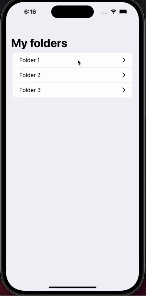

# SwiftUI Navigation Examples for iOS 14

## Overview
This repository hosts two sample iOS projects designed to demonstrate SwiftUI navigation in iOS 14, starting with a basic pattern and progressing to more complex structures.

### Projects
1. **SingleViewNavigation**: Basic list-detail navigation pattern.
2. **NestedNavigationExample**: Advanced nested navigation patterns.

## SingleViewNavigation

### Features
- **Basic Navigation:** Implements simple list-detail navigation.
- **List and Detail Views:** Uses `ItemListView` and `ItemDetailView` for displaying and editing items.
- **SwiftUI Fundamentals:** Demonstrates basic concepts including `@StateObject`, `@Binding`, etc.
- **Custom Navigation Modifiers:** Includes `conditionalNavigation` and other modifiers for complex scenarios.

## NestedNavigationExample

### Features
- **Nested Navigation:** Demonstrates advanced nested navigation structures.
- **Coordinator Pattern in SwiftUI:** Utilizes a Coordinator-like approach for navigation management.
- **List and Detail Views:** Implements `GenericListView` to display items like `MyItem` and`MyFolder`, which can still be edited in `ItemDetailView`.
- **Enhanced SwiftUI Concepts:** Showcases advanced use of `@StateObject`, `@Binding`, view modifiers, and more.

## Installation
1. **Clone the Repository**: `git clone https://github.com/nikolainobadi/iOS14SwiftUINavigation`.
2. **Open Desired Project**: Navigate to either `SingleViewNavigation` or `NestedNavigation` and open the `.xcodeproj` file in Xcode.
3. **Run the Project**: Choose an iOS Simulator or connected device and run the project.

## Usage
### SingleViewNavigation
- **Basic Item Viewing and Editing**: Use `ItemListView` and `ItemDetailView` for basic navigation and editing tasks.

### NestedNavigation
- **Advanced Item Viewing and Editing**: Utilize `GenericListView` for enhanced viewing and editing capabilities in nested navigation contexts.
- **Complex Navigation Flows**: Demonstrates sophisticated navigation paths and modal presentations.

## Screenshots

## Contributing
We welcome contributions to enhance these examples. Please adhere to the following steps:
1. Fork the repository.
2. Create a feature branch (`git checkout -b feature/myNewFeature`).
3. Make your changes.
4. Commit (`git commit -m 'Add a new feature'`).
5. Push to the branch (`git push origin feature/myNewFeature`).
6. Submit a Pull Request.

## License
These projects are open-source and available under the [MIT License](LICENSE).
